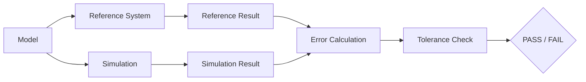

# BioForge Validation Framework

## 1. Validation Philosophy

Every scientific model must possess a rigorous validation framework. In computational biology, silent failures (where code runs without crashing but produces unphysical results) are far more dangerous than compile-time crashes. 

The BioForge platform is designed to make it structurally difficult to accidentally present an unvalidated model as scientific truth. Validation is not an afterthought; it is integrated directly into the CI/CD pipeline and the model documentation.

---

## 2. Validation Pipeline

The validation lifecycle for any implementation in BioForge follows a strict progression:



---

## 3. Model Documentation Requirements

For a scientific model to be accepted into the BioForge engine, its documentation must actively maintain:
* **Equations**: The exact mathematical formulations utilized.
* **Parameters**: The source of constants and variables.
* **Units**: Explicit dimensional requirements.
* **Numerical Method**: The integration or approximation scheme (e.g., Runge-Kutta, Verlet).
* **Reference Data**: What external source is acting as the ground truth.
* **Validation Tests**: The automated tests verifying the model against the reference data.
* **Benchmark**: Computational cost and scaling properties.
* **Limitations**: Documented boundary conditions where the model mathematically or physically breaks down.

---

## 4. Validation Levels

Validation is categorized into confidence tiers. Every module must declare its highest achieved validation level:

* **Level 0 (Syntactic)**: Code compiles, builds, and runs without runtime errors or crashes.
* **Level 1 (Algorithmic)**: Isolated unit tests pass; individual math functions are correct.
* **Level 2 (Analytical)**: Results match exact analytical mathematical solutions for simplified test systems (e.g., an unperturbed harmonic oscillator).
* **Level 3 (Computational)**: Results match established, trusted computational tools (e.g., GROMACS, NAMD, OpenMM) for standardized benchmark systems.
* **Level 4 (Empirical)**: Results match real-world experimental data (e.g., NMR, X-ray crystallography, binding affinities) within a rigorously documented margin of uncertainty.

---

## 5. Reference Systems (Future Implementation Phases)

BioForge will maintain a library of standard reference systems used exclusively for Level 2 and Level 3 validation:

* **Two-body gravitational/electrostatic system**: Verifies Newton's laws and the strict conservation of total energy and momentum.
* **Harmonic oscillator**: Verifies integration algorithms against known analytical solutions for frequency and phase.
* **Lennard-Jones fluid**: Evaluates thermodynamic properties (temperature, pressure, phase transitions) against established computational benchmarks.
* **Standard protein-ligand systems**: Evaluates structural stability and binding thermodynamics against experimental reference data.

---

## 6. Error Metrics

Depending on the domain, BioForge validation tests employ standard metrics to quantify deviation:
* **Absolute Error**: Direct numerical difference from the analytical solution.
* **Relative Error**: Percentage deviation, crucial for scale-independent validation.
* **RMSD (Root Mean Square Deviation)**: Standard for structural biology to measure atomic coordinate drift.
* **Conservation Violations**: Tracking energy drift ($\Delta E$) or momentum drift ($\Delta p$) over time to evaluate symplectic integrators.

---

## 7. Continuous Validation

Validation is not a one-time check. It is continuous.
* All Level 1 and Level 2 tests run on every pull request (CI).
* All Level 3 computational benchmarks run nightly or on major releases.
* Level 4 empirical validations are locked to specific parameter versions and rerun upon any changes to the core physical constants or force fields.

---

## 8. Reporting Template

When a validation suite is run, the output must adhere to a standardized format:

```text
=================================================
BIOFORGE VALIDATION REPORT
=================================================
Model:           [Model Name]
Date:            [Timestamp]
BioForge Ver:    [Version String]
-------------------------------------------------
System:          [Reference System Name]
Validation Lvl:  [0 - 4]
Target Metric:   [e.g., Total Energy Drift]
Reference Value: [Expected value + Units]
Simulated Value: [Actual value + Units]
Error (Abs):     [Value + Units]
Tolerance:       [Maximum allowed error]
-------------------------------------------------
STATUS:          [PASS / FAIL]
=================================================
```
